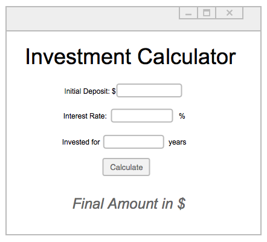
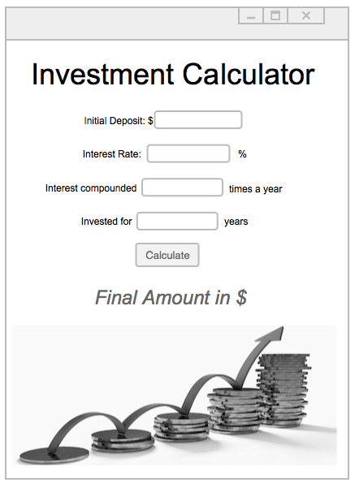

# Investment Calculator
A program to calculate the return on an investment at a given interest rate for a set number of years.

You must complete the assignment based on the UI Mock Up image. When the button is pressed the calculated final value of the investment should appear at the bottom of the application window.

Add a stylesheet to create an attractive application (make sure that you add it to git when prompted).

If you have everything working (and some extra time left):

- Add a transition when the final value is displayed (e.g. `FadeTransition` or `TranslateTransition`).
- Add a field to ask how many times annually the interest in compounded and include this in the calculation.
- Add an investment themed image (using an `ImageView`). Be sure to add the image file to git.

